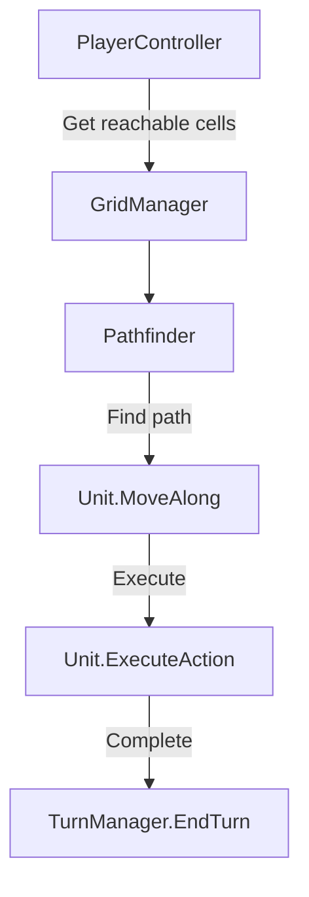
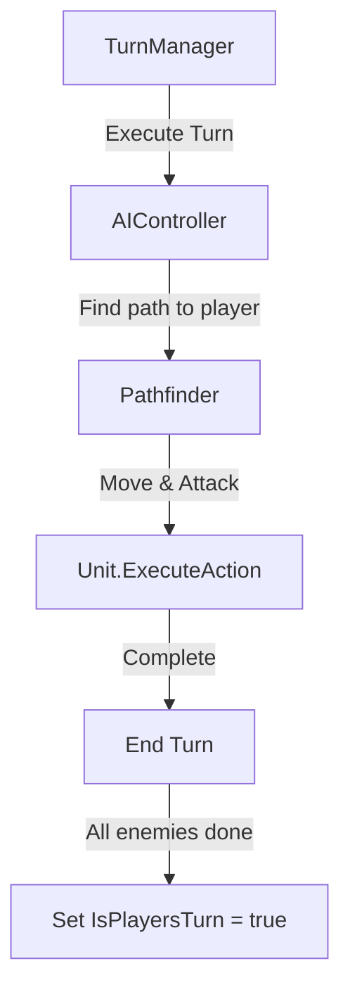
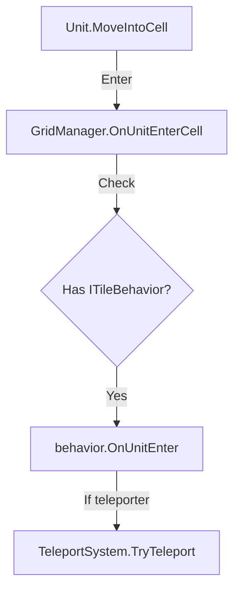

# 🎯 Quest System & Dialogue Framework (Unity + Ink Integration)

This project implements a comprehensive Quest and Dialogue System for Unity using **Ink** for narrative scripting.  
It manages player input, camera follow behavior, event broadcasting, quests with multi-step progress, and dialogue UI—all through a modular, event-driven architecture.

---

## 📁 Folder Overview

**`Scripts/QuestSystem/`**  
Contains all logic for:

- Quest management  
- Dialogue and Ink integration  
- Global event systems  
- UI interfaces  
- Player movement  
- Gold, input, and camera systems

--- 

## 🧩 Core Architecture

The system follows an **Event-Driven Architecture**, where each major gameplay feature (player, quests, dialogue, etc.) communicates through centralized event channels managed by the **GameEventsManager**.

All systems remain decoupled—allowing easy modification, extension, and testing.

---

##  ⚙️ Systems Overview

### 1. Camera System
**`FollowTarget.cs`**
- Attaches to the main camera  
- Keeps the camera aligned with a designated `targetTransform` (usually the player)  
- You can enable/disable following on X or Y axes and set an optional offset

### 2. Event System
**`GameEventsManager.cs`**
- Singleton that initializes and exposes all game event categories:
  - InputEvents  
  - PlayerEvents  
  - GoldEvents  
  - MiscEvents  
  - QuestEvents  
  - DialogueEvents  
- Each event class defines delegates and methods for invoking specific game actions

**Examples:**
```csharp
PlayerEvents.DisablePlayerMovement(); // freeze player movement during dialogue
QuestEvents.StartQuest("CollectCoinsQuest");
```

### 3. Input System
**`InputManager.cs`** + **`InputEvents.cs`**

Acts as a bridge between Unity's PlayerInput component and the event system.

Handles:
- Movement input (WASD or Arrow keys)
- Submit (confirm)
- Quest Log toggle

Input contexts (e.g., DEFAULT vs DIALOGUE) prevent input conflicts when in menus or during conversations.

### 4. Player System
**`PlayerContinuousGridMovement.cs`**

- Provides grid-based and mouse-click movement
- Supports both keyboard and mouse input
- Freezes during dialogue or UI interactions
- Animates walking via Animator parameters
- Handles grid snapping and direction flipping

### 5. Quest System
**Core Files:**

- **`QuestManager.cs`** – orchestrates all quest logic
- **`Quest.cs`** – represents individual quests
- **`QuestInfoSO.cs`** – defines quest data via ScriptableObjects
- **`QuestStep.cs`** – base class for quest steps
- **`QuestPoint.cs`** – interactable world objects that start or finish quests
- **`QuestStepState.cs`** / **`QuestData.cs`** – track save data
- **`QuestState.cs`** – enum for quest progress states
- **`QuestIcon.cs`** – updates quest marker visuals in-world

**Key Features:**

- Automatically loads all quests from `Resources/Quests/`
- Supports quest prerequisites and level requirements
- Saves quest progress using PlayerPrefs (JSON-serialized)
- Broadcasts quest state updates for UI and icons
- Integrates with Ink for quest triggers from dialogue

### 6. Example Quest
**`CollectCoinsQuestStep.cs`**

Demonstrates how to implement a custom quest step:

- Listens to onCoinCollected events
- Tracks progress toward a target number of coins
- Updates status text dynamically
- Completes automatically once requirements are met

### 7. Dialogue System (Ink Integration)
**Core Files:**

- **`DialogueManager.cs`** – handles Ink story playback
- **`InkDialogueVariables.cs`** – syncs Ink globals with Unity variables
- **`InkExternalFunctions.cs`** – binds C# functions (StartQuest, AdvanceQuest, etc.) callable from Ink scripts
- **`DialogueEvents.cs`** – manages dialogue-related events

**Workflow:**

1. DialogueManager receives an event (EnterDialogue)
2. It loads the Ink story, syncs variables, and starts playback
3. Each dialogue line and choice is displayed via the UI system
4. When the story ends, control returns to the player

External Function Examples:

```ink
~ StartQuest("CollectCoinsQuest")
~ AdvanceQuest("CollectCoinsQuest")
~ FinishQuest("CollectCoinsQuest")
```
### 8. UI System

**Dialogue UI**
- **`DialoguePanelUI.cs`** – displays dialogue text and choices
- **`DialogueChoiceButton.cs`** – represents interactive choice options
- Automatically reacts to dialogue events and updates via Ink story choices

**Quest Log UI**
- **`QuestLogUI.cs`** – toggles quest log visibility
- **`QuestLogScrollingList.cs`** – manages scrolling list of quests
- **`QuestLogButton.cs`** – individual quest entries with color-coded states

**Gold UI**
- **`GoldUI.cs`** – updates player gold count on screen

### 9. Gold & Collectibles

**`GoldManager.cs`**
- Tracks total gold and reacts to GoldGained events

**`Coin.cs`**  
Simple collectible that:
- Adds gold when collected
- Triggers a coin collection event for quests
- Respawns after a configurable delay

## 🔄 Data Flow Summary
1. Player interacts with a QuestPoint or dialogue node
2. DialogueManager triggers Ink story and handles player choices
3. Ink functions (like `StartQuest()`) call `GameEventsManager.questEvents`
4. QuestManager updates quest state and saves progress
5. QuestLogUI and QuestIcon update automatically through event subscriptions

## 💾 Saving and Loading
- Quest progress is serialized using JsonUtility and stored in PlayerPrefs
- Each quest uses its ScriptableObject ID as a unique key

> For production, replace this with a persistent save/load system.

## 🧠 Dependencies
- Unity Input System
- Ink Unity Integration
- TextMeshPro
- 2D Physics & Tilemaps

## 🧪 Extending the System
| Feature | How to Extend |
|---------|--------------|
| New Quest | Duplicate a `QuestInfoSO` under `Resources/Quests/` |
| New Step Type | Inherit from `QuestStep` |
| Dialogue Expansion | Add Ink files and reference in `DialogueManager` |
| New Events | Extend `GameEventsManager` |

## 🧭 Example Setup
1. Add a GameEventsManager prefab to the scene.
2. Add a QuestManager and GoldManager.
3. Assign a player prefab with PlayerContinuousGridMovement.
4. Add QuestPoint objects and link them to quest ScriptableObjects.
5. Add the Dialogue UI prefab and reference it in the scene.

## 🧱 Key Design Principles
- **Modularity:** Each subsystem (quests, dialogue, UI, input) is self-contained
- **Event-Driven:** Loose coupling between components using Unity Actions
- **Ink Integration:** Enables branching storytelling and quest logic from dialogue
- **Data Persistence:** Quests and variables persist across sessions


# ⚔️ Tactical Combat Framework (Tactics2D)
A modular 2D turn-based tactical combat framework for Unity.

## ✨ Features
- Grid-based movement and pathfinding
- Player and AI turn management
- Attack actions and visual feedback
- Teleport tiles and modular tile behaviors
- Orthographic camera auto-framing

## 📂 Directory Structure
```
Scripts/
 └── Tactical_Combat_Framework/
     ├── AI/
     │   └── AIController.cs
     ├── Camera/
     │   └── TacticalCameraController.cs
     ├── Controls/
     │   ├── PlayerController.cs
     │   └── TurnManager.cs
     ├── Grid/
     │   ├── GridManager.cs
     │   └── GridCell.cs
     ├── PathFinding/
     │   └── Pathfinder.cs
     ├── Systems/
     │   └── Teleport/
     │       └── TeleportSystem.cs
     ├── Tile/
     │   ├── DataTile.cs
     │   └── BehaviourTiles/
     │       ├── BehaviorTile.cs
     │       ├── ITileBehavior.cs
     │       └── Teleport_Behaviour/
     │           └── TeleportBehavior.cs
     ├── UI/
     │   └── HUDController.cs
     └── Units/
         ├── Team.cs
         ├── Unit.cs
         ├── UnitStats.cs
         └── UnitAction/
             ├── IUnitAction.cs
             └── Actions/
                 └── AttackAction.cs
```
## ⚙️ Core Systems Overview
## 🧩 1. Grid System
Handles logical grid construction, occupancy, and interaction callbacks (OnUnitEnterCell / OnUnitExitCell).

## 🧮 2. Pathfinding
Implements A* and BFS algorithms.
Supports teleportation shortcuts.

## 🤖 3. AI System
Simple heuristic AI:

Finds nearest player

Moves toward or attacks

Waits between actions for pacing

## 🧍 4. Player Control
Click-based tactical controls:

Select → Move → Attack

Cancel with right-click

## 🔁 5. Turn Management
Alternates between player and AI phases using coroutines.

## ✨ 6. Teleport System
Registers teleport groups and handles instant transport between tiles.

## 🧱 7. Tile & Behavior System
Allows custom tile behaviors via ITileBehavior (e.g., traps, portals, healing).

## ⚔️ 8. Units
Each unit manages its stats, team, actions, and movement animation.

## 🗡️ 9. Unit Actions
Modular IUnitAction interface enables custom skills (AttackAction, HealAction, etc.).

## 🎥 10. Camera System
Auto-centers and zooms to include all active units.

## 🧠 11. UI System
Optional HUDController for displaying current turn, tile info, and unit stats.

## ⚡ Setup Guide
1. Create a Tilemap and attach GridManager.
2. Create DataTile and BehaviorTile assets.
3. Add unit prefabs and managers (TurnManager, AIController).
4. Assign TacticalCameraController to the main camera.
### More Detailed explenation 


## ⚙️ Core Systems

### 🧩 1. **Grid System**

#### `GridManager.cs`
- Builds the logical grid from a **Tilemap**.  
- Stores movement costs, occupancy, and references to tile behaviors.
- Handles highlighting and tile-based interactions.  
- Calls behavior hooks (`OnUnitEnterCell`, `OnUnitExitCell`) when units move.

#### `GridCell.cs`
Represents a single logical tile on the grid:
- Position (`GridPos` / `WorldCenter`)
- Walkability and visibility
- Occupancy tracking (`AddOccupant`, `RemoveOccupant`)

---

### 🧮 2. **Pathfinding**

#### `Pathfinder.cs`
Implements:
- **A\*** pathfinding for movement (`FindPath`)
- **BFS Flood Fill** for range preview (`FloodFill`)
- Supports **teleport tiles** as part of navigation (zero-cost warp links).

Example usage:
```csharp
var path = Pathfinder.FindPath(grid, startCell, goalCell);
var range = Pathfinder.FloodFill(grid, startCell, unit.Stats.maxMove);
```

### 🤖 3. AI System
**`AIController.cs`**  
Controls enemy turns and decisions:

- Finds the nearest player unit
- If in range → attacks
- Otherwise moves toward the player and attacks if possible
- Waits between actions to simulate thinking time
- Works cooperatively with the TurnManager

### 🧍 4. Player Control
**`PlayerController.cs`**  
Handles player clicks and turn actions:

- Left-click → select a friendly unit
- Left-click on empty cell → move
- Left-click on enemy → attack
- Right-click → cancel selection

Integrates with GridManager for highlighting movement range and TurnManager for turn flow.

### 🔁 5. Turn Management
**`TurnManager.cs`**  
Coordinates player and enemy turns:

- Alternates between player and AI phases
- Delegates all AI behavior to AIController.ExecuteTurn
- Calls `EndTurn()` when actions complete

Example:
```csharp
turnManager.EndTurn(); // switches to next phase automatically
```

### ✨ 6. Teleport System
**`TeleportSystem.cs`**
Manages all teleporter tiles, grouped by string IDs (e.g., "A", "B", "C"):

- Handles registering teleport tiles into groups
- Teleports units when entering a teleport tile
- Can trigger visual effects and hide the unit during transport
- Integrates seamlessly with the GridManager and pathfinding logic

**`TeleportBehavior.cs`**
- Implements the ITileBehavior interface
- Registered via BehaviorTile assets
- Automatically links teleport tiles with their group and effects

Example:
```csharp
TeleportSystem.Instance.RegisterTeleport(tilePos, "A", teleportFX);
```
### 🧱 7. Tile & Behavior System

#### **`DataTile.cs`**
A base tile asset with:
- `walkable`
- `moveCost`
- `blocksVision`

#### **`BehaviorTile.cs`**
Extends `DataTile` by allowing a linked ScriptableObject implementing `ITileBehavior`.
This allows flexible tile interactions (teleports, traps, healing zones, etc.).

#### **`ITileBehavior.cs`**
Defines the contract for any interactive tile:
```csharp
public interface ITileBehavior {
    void Initialize(GridManager grid, Vector3Int position);
    void OnUnitEnter(Unit unit, GridManager grid);
    void OnUnitExit(Unit unit, GridManager grid);
}
    ### ⚔️ 8. Units

    #### **`Unit.cs`**
    The central component for all characters:
    - Contains cloned runtime stats and action instances
    - Handles movement, combat, and animation
    - Supports `MoveAlong(path)` and `TakeDamage()` behaviors
    - Automatically registers with its starting grid cell

    #### **`UnitStats.cs`**
    ScriptableObject defining:
    - HP, attack power/range, movement speed/range
    - Team affiliation
    - Optional visual damage color

    #### **`Team.cs`**
    Enum for differentiating factions:
    ```csharp
    public enum Team { Player, Enemy, Neutral }
    ```
### 🗡️ 9. Unit Actions

#### **`IUnitAction.cs`**
Defines the structure for all unit abilities:
```csharp
public interface IUnitAction {
    string ActionName { get; }
    bool CanExecute(Unit unit);
    IEnumerator Execute(Unit unit);
}
```

#### **`AttackAction.cs`**
A ScriptableObject implementing `IUnitAction`:
- Finds the nearest enemy within attack range
- Animates attack motion and triggers VFX
- Applies damage and flashes target color
- Integrates with Unity Animator via a configurable trigger

### 🎥 10. Camera System
#### **`TacticalCameraController.cs`**
Smart orthographic camera that:
- Automatically centers and zooms to include all active units
- Allows manual zoom with scroll wheel
- Smoothly transitions between focus targets

**Methods:**
```csharp
EnableAutoFocus(true);
ForceRecenter();
```

### 🧠 11. UI System
#### **`HUDController.cs`** (optional)
Provides runtime UI for:
- Current turn display
- Selected unit stats
- Current tile info
- "End Turn" button integration

## 🧭 System Architecture Diagram
```mermaid
                 ┌──────────────────────────┐
                 │      TacticalCamera      │
                 │ (auto focus & zoom)      │
                 └──────────┬───────────────┘
                            │
                            ▼
┌───────────────────────────────────────────────────────────────┐
│                           Scene                               │
│                                                               │
│  ┌──────────────────────────────┐    ┌────────────────────┐   │
│  │        TurnManager           │◄──►│    PlayerController │   │
│  │ - Controls turn flow         │    │ - Handles input     │   │
│  │ - Calls AIController         │    │ - Select/move/attack│   │
│  └──────────────────────────────┘    └────────────────────┘   │
│             ▲                         ▲                       │
│             │                         │                       │
│             │                         │                       │
│  ┌──────────────────────────────┐     │                       │
│  │        AIController          │─────┘                       │
│  │ - Enemy decision making      │                             │
│  │ - Chooses target & moves     │                             │
│  │ - Executes attacks           │                             │
│  └──────────────────────────────┘                             │
│                                                               │
│  ┌───────────────────────────────────────────┐                │
│  │                Unit                       │                │
│  │ - Holds stats, team, actions              │                │
│  │ - Moves along path, takes damage          │                │
│  │ - Interacts with tile behaviors           │                │
│  └──────────────┬────────────────────────────┘                │
│                 │                                             │
│                 ▼                                             │
│        ┌────────────────────────────┐                         │
│        │        GridManager         │                         │
│        │ - Builds logical grid      │                         │
│        │ - Tracks occupancy, cost   │                         │
│        │ - Calls ITileBehavior hooks│                         │
│        └──────────────┬─────────────┘                         │
│                       │                                       │
│                       ▼                                       │
│         ┌──────────────────────────────┐                      │
│         │        Pathfinder            │                      │
│         │ - A* pathfinding             │                      │
│         │ - BFS range (FloodFill)      │                      │
│         │ - Teleport-aware navigation  │                      │
│         └──────────────┬───────────────┘                      │
│                        │                                      │
│                        ▼                                      │
│         ┌──────────────────────────────┐                      │
│         │       TeleportSystem         │                      │
│         │ - Registers teleport tiles   │                      │
│         │ - Handles group teleportation│                      │
│         │ - Plays VFX and hides unit   │                      │
│         └──────────────┬───────────────┘                      │
│                        │                                      │
│                        ▼                                      │
│           ┌──────────────────────────────┐                    │
│           │      ITileBehavior API       │                    │
│           │ (TeleportBehavior, etc.)     │                    │
│           │ - Reacts to OnUnitEnter/Exit │                    │
│           └──────────────────────────────┘                    │
│                                                               │
│  ┌────────────────────────────┐    ┌────────────────────┐     │
│  │       UnitStats (SO)       │    │   AttackAction (SO)│     │
│  │ - Defines HP, move, atk    │    │ - Implements IUnitAction ││
│  │ - Instantiated per unit    │    │ - Damage & animation FX   ││
│  └────────────────────────────┘    └────────────────────┘     │
│                                                               │
└───────────────────────────────────────────────────────────────┘
```

## 🔄 Data Flow Summary

### 1. Player Turn

### 2. Enemy Turn

### 3. Movement + Tile Behavior



